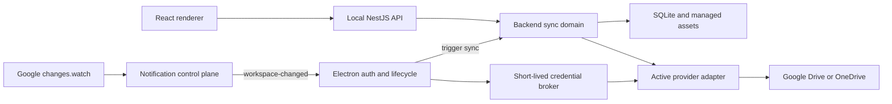

# Phase 10: Cloud Synchronization

## Purpose

Phase 10 adds local-first synchronization through one active cloud provider: Google Drive or Microsoft OneDrive. SQLite remains the local working database used by the application. Cloud storage contains a versioned JSON representation of the synchronized domain plus separate binary asset files; the SQLite database and WAL files are never uploaded.

The synchronization system must converge after offline work, restarts, duplicate notifications, and concurrent changes without silently discarding user data. Provider notifications are wake-up hints only. Google and Microsoft change cursors remain the authoritative way to discover remote changes.

This document defines the target solution for the completed phase. The implementation tasks are intentionally incremental, but they are not temporary architecture variants.

## Goals

- Synchronize notes, note templates, fields, labels, general settings, and managed image assets between devices.
- Keep synchronization explicitly opt-in: fresh installs and upgrades start disabled with no provider selected.
- Support exactly one active provider per local installation after the user enables synchronization.
- Use Google Drive's hidden `appDataFolder` with the narrow `drive.appdata` permission.
- Use OneDrive's `special/approot` with `Files.ReadWrite.AppFolder` and avoid full-drive read permissions.
- Upload and download only changed logical records and assets.
- Persist local writes durably before attempting network work.
- Propagate deletions through tombstones without allowing stale devices to resurrect data.
- Detect concurrent changes through three-way reconciliation and conditional provider writes.
- Preserve recoverable copies when changes cannot be merged safely.
- Synchronize before notes are first displayed when possible, while retaining an explicit Work offline escape.
- Provide Google near-real-time wake-ups through a content-free hosted notification service.
- Keep OAuth refresh credentials in OS-backed Electron storage and outside React, normal SQLite settings, logs, and the notification service.
- Keep provider outages and relay outages from making the local application unusable.

## Non-Goals

- Synchronizing SQLite database or WAL files.
- Activating Google Drive and OneDrive simultaneously.
- Multi-user collaboration, sharing, or permissions.
- A NoteStack-hosted replacement for provider storage.
- Requesting broad OneDrive read permissions only to obtain instant notifications.
- Sending note data, configuration, assets, OAuth tokens, or account email addresses through notification payloads.
- Using timestamps alone for last-writer-wins conflict resolution.
- Automatically deleting data from a disconnected or previous provider.
- Tombstone or asset garbage collection before all-device acknowledgement and safe compaction are designed.
- Mobile or browser clients.
- End-to-end encryption of provider payloads. Provider-side encryption remains in effect, but the provider can read stored JSON and assets.

## Core Invariants

1. Synchronization is disabled with no provider selected by default; until explicit opt-in, the app performs no provider OAuth, cloud API, relay, polling, or synchronization network activity.
2. SQLite is the local source used by the UI; the remote representation is a synchronization transport and recovery source.
3. Once a workspace is active, a local domain mutation and its outbox mutation are committed in the same SQLite transaction.
4. Synchronization runs are single-flight and pull before they push.
5. A provider cursor advances locally only after all corresponding remote changes have been applied successfully in SQLite.
6. Provider notification delivery is never required for correctness.
7. Provider change cursors, remote versions/ETags, content hashes, mutation IDs, and stored merge bases determine reconciliation. Wall-clock timestamps are descriptive only.
8. Asset bytes are uploaded successfully before a remote note/configuration document is allowed to reference them.
9. Conditional writes protect every mutable remote JSON document.
10. Repeated delivery of the same mutation is idempotent.
11. Concurrent changes never silently discard user content.
12. The renderer never receives OAuth refresh credentials or provider SDK clients.
13. The notification service never receives provider credentials or synchronized user content.
14. OneDrive stays on `Files.ReadWrite.AppFolder`; its adaptive delta polling is a deliberate least-privilege design.

## System Architecture



### Backend ownership

The backend owns:

- SQLite migrations and all domain transactions.
- Workspace/device identity that is not secret.
- Asset catalog and managed local files.
- Tombstones and durable mutation outbox.
- Canonical serialization and remote document mapping.
- Merge bases, provider cursors, remote IDs/versions, and conflicts.
- Provider-neutral reconciliation.
- Provider storage adapters, using short-lived credentials supplied through a narrow broker.
- Sync status and manual/conflict/repair APIs exposed through Swagger.

Keep these responsibilities in a concrete `backend/src/modules/sync` domain and adjacent owning domains. Do not fold synchronization into export/import and do not create generic service-root buckets.

### Electron ownership

Electron owns:

- System-browser OAuth Authorization Code + PKCE flows.
- Loopback/callback handling for development and packaged applications.
- OS-backed secure persistence and refresh of provider credentials.
- A narrow authenticated boundary that supplies short-lived access to the backend without exposing refresh credentials.
- Startup, focus, resume, connectivity, relay WebSocket, and bounded quit-flush triggers.
- Consistent application data-root configuration passed to the backend.

### Frontend ownership

React owns:

- Settings > Synchronization configuration and account status.
- App-bar sync status and Sync now action.
- Startup synchronization, retry, and Work offline presentation.
- Localized error, pending-change, and conflict-recovery UI.
- TanStack Query invalidation after remote changes are applied.

React must not own provider clients, tokens, cursor logic, merge logic, or remote document construction.

### Notification service ownership

The separately deployable notification service owns only:

- Public Google webhook validation and fast acknowledgement.
- Authenticated outbound WebSocket connections to active desktop clients.
- Opaque workspace/channel/device routing metadata.
- Verification-token hashes, channel expiration, and renewal leases.
- Notification coalescing, rate limits, health checks, and redacted operational logs.

It never stores notes, settings, assets, provider access/refresh tokens, cloud account identifiers, or provider file contents.

## Logical Remote Layout

The reconciliation engine uses these provider-neutral logical keys:

```text
workspace.json
config.json
notes/{note-id}.json
assets/{sha256}.{safe-extension}
```

Provider adapters map logical keys to provider file IDs and physical names. Google may use flat names internally if that is more reliable in `appDataFolder`; no higher layer may depend on provider paths.

### Workspace document

`workspace.json` identifies a NoteStack dataset and protocol generation:

```json
{
  "formatVersion": 1,
  "workspaceId": "uuid",
  "createdAt": "2026-07-31T12:00:00.000Z",
  "createdByDeviceId": "uuid",
  "notificationRouting": {
    "workspaceRouteId": "opaque-random-id",
    "notificationAuthKey": "base64url-encoded-32-random-bytes",
    "secretVersion": 1
  }
}
```

`notificationAuthKey` is exactly 32 cryptographically random bytes encoded as unpadded base64url in `workspace.json`. Provider application-data access is the transport and access boundary that lets another authorized device retrieve it during pairing. It authorizes relay routing only and grants no provider-data access. The relay stores only a salted verifier/derived key, never the key itself. Parsing rejects invalid length/encoding. Rotation increments `secretVersion`, updates `workspace.json` conditionally, gives connected devices a bounded rollover window, and is required after reset, suspected compromise, or explicit remote-disconnect.

### Note document

Each note is one mutable, conditionally written document:

```json
{
  "formatVersion": 1,
  "entityType": "note",
  "entityId": "uuid",
  "workspaceId": "uuid",
  "contentHash": "sha256",
  "parentHash": "sha256-or-null",
  "mutationId": "uuid",
  "modifiedBy": "device-uuid",
  "modifiedAt": "2026-07-31T12:00:00.000Z",
  "deletedAt": null,
  "payload": {
    "noteTypeId": "uuid",
    "background": null,
    "values": {}
  }
}
```

`modifiedAt` supports presentation and diagnostics. It cannot decide conflicts. `parentHash` and the locally stored last reconciled document establish ancestry.

### Configuration document

`config.json` is one complete, small configuration graph containing:

- note templates;
- fields/columns and their configuration;
- labels;
- general settings;
- configuration tombstones;
- configuration ordering metadata;
- the same envelope metadata used for hashing, ancestry, mutation identity, and author device.

The document is uploaded as a whole, but reconciliation merges its entities by stable UUID. Reordering needs stable deterministic semantics; implementation should prefer explicit order keys and merge changes against the stored base rather than treating the latest array as authoritative.

### Asset reference

Notes reference managed assets without embedding bytes:

```json
{
  "assetId": "sha256-of-file-bytes",
  "fileName": "whiteboard.png",
  "mimeType": "image/png",
  "size": 182340,
  "width": 1600,
  "height": 900,
  "altText": "Whiteboard"
}
```

Remote assets are immutable and content-addressed. A mismatched downloaded hash is corruption and must never replace a valid local file.

## Remote Format Versioning

- Every JSON document contains `formatVersion`.
- Readers reject unsupported newer versions without partially applying them.
- Provider adapters do not migrate document content; the provider-neutral mapping layer does.
- A future format migration writes compatible new documents through normal conditional synchronization.
- Unknown fields from a supported version should be ignored when safe, but canonical hashing must define whether they are retained.
- Corrupt or incomplete remote documents are quarantined and reported; they do not advance the cursor as successfully applied until a repair decision is durable.

## Local Data Model

Exact names may be refined during T100, but the ownership and information must remain. T100 also establishes a recoverable SQLite backup facility and verifies a backup before any Phase 10 migration changes existing data:

### Workspace and device identity

- Stable local `device_id` generated with `uuid/v4`.
- Active `workspace_id`.
- Synchronization enablement defaulting to disabled, with a nullable active provider and non-secret account/workspace metadata.
- Provider connection state, last success, last attempted sync, and last error classification.

### Provider state

Per logical remote object:

- entity kind and ID/logical key;
- provider file/item ID;
- provider ETag/version;
- last reconciled content hash;
- last reconciled canonical JSON merge base;
- provider-specific non-secret metadata required to resume transfers.

Per provider workspace:

- Google start/change page token or OneDrive delta link;
- cursor generation and invalidation state;
- last successful full enumeration;
- notification/channel health where applicable.

### Durable outbox

Each entry needs:

- mutation UUID;
- entity kind and entity ID;
- operation/upsert/tombstone intent;
- base hash and current target hash;
- creation time and originating device;
- attempt count, next retry time, and last failure classification;
- crash-safe claim/lease fields;
- completion/coalescing state.

Repeated edits to the same entity may coalesce to the newest desired document while retaining idempotent mutation identity and the original last-synchronized base.

### Conflicts

Persist:

- conflict UUID and type;
- affected entity and field paths where known;
- base, local, and remote hashes/documents or recoverable references;
- resolution state and generated conflict-copy entity ID;
- timestamps for presentation only.

### Assets

Persist:

- SHA-256 asset ID;
- MIME type, size, safe extension, and display metadata;
- managed path relative to the application data root;
- integrity/availability state;
- provider remote ID/version/transfer state;
- reference state sufficient for conservative retention.

### Tombstones

Notes and sync-relevant configuration entities require deletion mutation ID, deletion device ID, and `deletedAt`. Normal product queries exclude tombstones. Sync, recovery, diagnostics, and appropriate export paths can include them.

Remote tombstones remain indefinitely during this phase. An elapsed-time-only cleanup is unsafe because a device can return after a longer offline period and resurrect deleted state.

## Local Asset Migration

Existing image values contain base64 `dataUrl` values in `note_values.value_json`, and the type also permits non-portable local paths. T101 must:

1. Establish one consistent data root from Electron for SQLite and managed assets.
2. Decode each valid base64 image and calculate SHA-256 over its bytes.
3. Validate supported MIME type, decoded size, and optional dimensions.
4. Write to a temporary file in the managed asset directory, flush/close it, and atomically rename it.
5. Insert or reuse the asset catalog row.
6. Replace the embedded value with a portable asset reference in the same migration transaction where possible.
7. Remain idempotent if interrupted and rerun.
8. Preserve the original database backup until migration and verification finish.

External HTTP(S) image URLs may remain external references only if the product already intentionally supports them. Local filesystem paths must be imported into managed assets or rejected with a recoverable validation result; they cannot enter remote JSON.

JSON export/import must remain portable. The chosen export container must include or materialize managed asset bytes rather than exporting machine-local paths. XLSX import continues to create managed assets before note references are committed.

Do not implement aggressive orphan deletion. Failed uploads and interrupted migrations may leave safe, unreferenced files that can be reported and cleaned only after a later acknowledgement design.

## Mutation and Outbox Flow

Before a workspace is configured, product changes remain local and do not accumulate historical outbox operations. Pairing reads one transactionally consistent current-state snapshot, resolves seed/restore/merge with the user, binds the workspace, stores that resolved snapshot as the first merge base, and only then journals the desired remote differences. Once a workspace is active, every write path must be audited, including indirect changes:

- note create/update/background/delete/delete-all;
- note template create/update/delete and note moves;
- field create/update/reorder/hide/delete and value deletion;
- label create/update/delete and label-reference cleanup;
- general settings updates;
- JSON/XLSX imports;
- conflict resolution and repair operations.

For an active workspace, the domain change and sync intent share one transaction:

```text
BEGIN
  apply domain mutation or tombstone
  update consistent mutation metadata
  append/coalesce sync outbox mutation
COMMIT
```

Controllers do not manually add outbox entries. Repository/domain services expose transactional operations so cascade and indirect mutations cannot escape journaling.

Outbox processing uses leases and idempotency. A crash after a remote write but before local completion is recovered by comparing mutation ID, hash, and provider version on the next run.

## Reconciliation State Machine

Only one run can be active. Multiple triggers coalesce into another requested run.

```text
idle
  -> authenticating
  -> pulling metadata changes
  -> downloading required documents/assets
  -> reconciling and applying in SQLite
  -> pushing assets
  -> conditionally pushing JSON documents
  -> verification pull
  -> committing final cursor/state
  -> idle | attention | offline
```

### Pull-before-push algorithm

1. Acquire the synchronization lease.
2. Obtain a short-lived provider credential.
3. Read changes from the stored provider cursor.
4. Download only new/changed JSON documents and required assets.
5. Validate schema, workspace ID, hashes, relationships, and asset integrity.
6. Compare base/local/remote state and compute merge/conflict results.
7. Apply remote/merged state, conflicts, remote metadata, and the candidate cursor transactionally.
8. Do not publish the candidate cursor as committed if the transaction fails.
9. Re-read/coalesce the durable outbox.
10. Upload missing immutable assets first.
11. Conditionally create/update note/configuration documents using remote version/ETag.
12. On a precondition failure, fetch the new remote version and return to reconciliation instead of overwriting.
13. Perform a verification pull to catch concurrent changes and webhook echo races.
14. Mark completed outbox entries and final provider state durably.
15. Release the lease and publish status/cache invalidation.

### Three-way classification

| Local compared with base | Remote compared with base | Result                        |
| ------------------------ | ------------------------- | ----------------------------- |
| unchanged                | unchanged                 | no-op                         |
| changed                  | unchanged                 | push local conditionally      |
| unchanged                | changed                   | apply remote                  |
| same resulting hash      | same resulting hash       | mark synchronized             |
| changed differently      | changed differently       | merge or preserve conflict    |
| deleted                  | unchanged                 | push tombstone                |
| unchanged                | deleted                   | apply tombstone               |
| edited                   | deleted                   | preserve delete/edit conflict |

Provider file deletion is not a NoteStack tombstone. Missing files caused by manual provider manipulation are repair conditions. A known live local document should not be silently converted into a deletion merely because its provider file disappeared.

## Conflict Policy

### Notes

- Different note IDs reconcile independently.
- Disjoint field changes on the same note can merge against the stored base.
- Concurrent changes to the same field produce a recoverable conflict record/copy.
- A UUID collision with unrelated ancestry produces a new conflict-copy UUID.
- Concurrent delete and edit keeps the tombstone for the original lineage and preserves edited content as a conflict copy.
- Background changes participate like any other note field and must update mutation metadata consistently.

### Configuration

- Merge templates, fields, and labels by stable UUID.
- Tombstones take part in ancestry checks and cannot be ignored because an entity is absent from one document.
- Independent scalar changes merge.
- Conflicting scalar changes are resolved deterministically but retain a recoverable conflict record and user notification.
- Ordering conflicts use stable order metadata and deterministic tie-breaking by mutation/device identity, not timestamps.
- Reference validation occurs before commit so notes cannot point at missing templates/fields/labels after a merge.

### User recovery

The user should see plain summaries such as `Recovered conflict from another device`, with actions to inspect, keep one version, or retain both. The initial automatic behavior must favor preservation over silent replacement.

## Provider Adapter Contract

The backend reconciliation engine depends on a narrow provider-neutral contract supporting:

- discover/create workspace;
- enumerate initial metadata;
- list changes after a cursor;
- read JSON and binary content;
- conditionally create/update mutable JSON;
- create/read immutable content-addressed assets;
- map provider file IDs and remote versions;
- classify provider not-found, precondition, authentication, throttling, quota, transient, and permanent errors;
- restart safely after an invalid/expired cursor;
- expose Retry-After where available.

Provider SDK DTOs must not leak into the reconciliation or domain model.

Contract tests run identically against the fake, Google, and OneDrive adapters where provider semantics permit.

## Google Drive Adapter

- Use `appDataFolder` and `https://www.googleapis.com/auth/drive.appdata`.
- Store logical object classification in stable provider metadata or the adapter's local mapping; do not depend on a user-visible folder.
- Use `changes.getStartPageToken` and `changes.list` with the `appDataFolder` space.
- Store file IDs and remote version metadata locally.
- Handle invalid/expired tokens by performing a safe metadata rescan and reconciling against local bases before writing.
- Use suitable multipart/resumable upload behavior for assets and validate completed bytes.
- Use conditional/version-aware writes; a conflicting remote version returns control to reconciliation.
- Google webhook delivery only wakes the desktop. The desktop always calls the changes feed.

## OneDrive Adapter

- Use `special/approot` with delegated `Files.ReadWrite.AppFolder`.
- Use delta links scoped to the application workspace and store the final delta link only after successful local application.
- Use drive item IDs and ETags for conditional writes.
- Use upload sessions where asset size/reliability requires them and resume or restart safely.
- Handle HTTP 410/invalid delta state through full safe enumeration and three-way reconciliation.
- Honor throttling and Retry-After.
- Do not request `Files.Read` or `Files.Read.All` merely for notifications.

Microsoft currently requires broad read permission for OneDrive change-notification subscriptions, and OneDrive for Business restricts subscriptions to the drive root. Therefore adaptive app-folder delta polling is the completed least-privilege architecture, not a temporary fallback.

## Notification Control Plane

Google Drive requires a public HTTPS receiver for `changes.watch`. Add a separately deployable TypeScript service/package rather than exposing a desktop callback.

### Registration and routing

1. An authorized desktop obtains the workspace notification secret from synchronized workspace state.
2. It authenticates to the relay with a challenge derived from the secret and receives a short-lived connection token.
3. It registers an unguessable route/channel identifier and verification token hash.
4. The desktop creates the Google watch channel using its own short-lived Google credential and the relay webhook URL.
5. The desktop finalizes channel ID, resource ID, expiration, and non-secret routing state with the relay.
6. The relay validates every webhook and maps it to the workspace without reading provider data.
7. It coalesces bursts and broadcasts only `workspace-changed` to authenticated connected devices.

### Subscription renewal

Google change channels expire after at most one week and must be replaced. The relay grants a time-bounded renewal lease to one connected device. That credential-bearing device creates the replacement channel and finalizes it with the relay. Overlap is allowed during replacement and duplicate notifications are coalesced.

If no device is online, no credential is stored centrally. The next device startup recreates the channel and performs an immediate changes-feed reconciliation first.

### Deployment requirements

- Public TLS endpoints for Google validation/notifications.
- Authenticated WebSockets with heartbeat, bounded queues, and reconnect support.
- Durable opaque channel registry and expiry/lease state.
- Horizontal-worker broadcast coordination.
- Fast webhook acknowledgement before asynchronous processing.
- Rate limits, body/header limits, replay/duplicate controls, and secret rotation.
- Structured logs with no synchronized content, provider credentials, account email, or raw secrets.
- Health, readiness, metrics, alerting, backup, rollout, and rollback documentation.

Implementation may select a managed WebSocket/durable-state platform or a conventional service with durable storage and pub/sub. T111 must lock and document that deployment choice before application integration relies on it.

## OAuth and Credential Security

- Ship registered Google and Microsoft public/native application identities; users do not enter client IDs or secrets.
- Use system-browser Authorization Code with PKCE.
- Validate state, PKCE verifier, redirect target, callback timeout, and account/provider identity.
- Desktop applications contain no client secret.
- Initialize no provider OAuth flow or credential storage until explicit enablement and provider selection.
- Store refresh credentials only through OS-backed secure storage owned by Electron.
- Keep access credentials short-lived and in memory.
- The backend receives only the narrow access needed for a run through an authenticated local broker.
- The renderer receives provider name, account display metadata, connection status, and errors only.
- Disconnect revokes credentials where supported and removes local secure storage after the user's confirmed choice.
- Logs, errors, crash reports, IPC messages, command lines, environment variables, and backend HTTP responses must redact credentials and callback codes.
- A wrong signed-in account or mismatched workspace blocks automatic merge and asks the user to choose the intended account/workspace.

## Synchronization Triggers

| Trigger/state                  | Behavior                                                      |
| ------------------------------ | ------------------------------------------------------------- |
| configured and enabled startup | pull/reconcile before notes mount                             |
| local mutation                 | debounce 3-5 seconds, maximum 30 seconds                      |
| manual Sync now                | immediate single-flight run                                   |
| focus/resume                   | immediate if last check is stale                              |
| network recovery               | immediate with jitter/coalescing                              |
| successful local push          | verification pull after a short delay                         |
| Google relay signal            | coalesce briefly, then changes-feed pull                      |
| Google relay/channel unhealthy | adaptive polling around 60 seconds while active               |
| Google relay healthy           | watchdog roughly every 15 minutes while active                |
| OneDrive active                | adaptive delta polling roughly every 30-60 seconds            |
| repeated empty OneDrive checks | back off while idle, reset on activity/focus                  |
| minimized/background           | watchdog roughly every 10-15 minutes                          |
| transient failure              | exponential backoff with jitter and Retry-After               |
| application quit               | short bounded best-effort flush; outbox remains authoritative |

All triggers are no-ops while synchronization is disabled. After enablement, trigger storms never create overlapping runs; they set a pending-run flag serviced after the active run finishes.

## Startup and Offline Behavior

The startup sequence becomes:

```text
Electron/backend starting
  -> backend ready
  -> read synchronization enablement
      -> disabled: ready with local data; no sync network activity
      -> enabled: obtain credentials -> initial synchronization -> ready
```

When synchronization is disabled, the normal local application mounts immediately and does not initialize provider or relay connectivity. When synchronization is enabled, Notes and Settings queries do not mount until initial reconciliation completes or the user explicitly chooses Work offline.

The synchronization wait is bounded for UX, not correctness. After a soft threshold, show Retry, Work offline, and relevant account/reconnect actions. Work offline displays the last local state, keeps outbox writes durable, and shows a persistent pending/offline indicator. Returning online resumes normally.

## Backend API Direction

Swagger remains the source of truth. Exact routes may follow existing conventions, but the surface needs:

- current synchronization status;
- active provider/account/workspace metadata without secrets;
- connect preparation/completion coordination with Electron;
- manual synchronization;
- disconnect/switch/reset/repair commands;
- pending mutation count and last success/error;
- list/detail/resolve synchronization conflicts;
- startup synchronization state suitable for the existing gate.

Status should distinguish at least:

```text
disabled
connecting
syncing
synced
offline
attention-required
error
```

Errors must be stable classifications that the localized frontend can turn into actionable copy. Regenerate frontend API types after backend contracts change. Request functions continue returning full Axios promises directly without `await`.

## User Experience

### Settings > Synchronization

Show:

- An initial disabled state with no selected provider;
- An explicit Enable synchronization action followed by Google Drive or OneDrive selection;
- active provider and signed-in account display information;
- workspace identity in support-friendly but non-technical form;
- last successful synchronization;
- pending local change count;
- current sync/error/conflict state;
- Sync now;
- reconnect/sign-in-again where needed;
- change provider;
- disconnect;
- repair/reset actions only when appropriate.

Synchronization remains disabled until explicit user opt-in. Enabling it starts provider selection and the T113 pairing state machine. Disabling it stops polling, relay connections, and cloud writes while retaining the workspace binding, durable outbox, and local data. Local changes made while disabled continue to journal against the bound workspace and upload after re-enablement; disconnect, credential removal, and remote-data deletion remain separate confirmed choices. When enabled, there is exactly one active provider. Users never configure folder paths, OAuth tokens, redirect URLs, or application IDs.

### App bar

While synchronization is disabled, show no synchronization action or status in the app bar; configuration remains available only under Settings > Synchronization. Once enabled, provide a compact accessible status/action for syncing, synced, offline/pending, or attention-required. Manual synchronization is disabled or deduplicated while a run is already active.

### Conflict recovery

Explain preserved conflicts without provider or hashing jargon. Offer inspect/keep/duplicate resolution where a decision is needed. Automatic conflict copies should remain searchable and clearly identified until acknowledged.

All new copy is localized.

## Initial Pairing and Provider Switching

### Pairing cases

- Cloud empty, local populated: create workspace and seed it after a local backup.
- Cloud populated, local empty: verify workspace and restore it locally.
- Both populated with the same workspace: normal reconciliation.
- Both populated with different/unknown workspace identity: show a preview and require an explicit merge/replace/cancel choice.

Before the first Phase 10 data-model migration, T100 creates and verifies a recoverable local SQLite backup. Pairing and provider switching reuse that facility before destructive local replacement. Asset migration also preserves source data until verification succeeds.

### Switching providers

1. Synchronize outstanding work with the old provider, or require an explicit decision to continue with pending work retained locally.
2. Authenticate the new provider.
3. Discover/create and validate its workspace.
4. Preview seed, restore, or merge behavior.
5. Reconcile and verify the new provider.
6. Mark it active only after success.
7. Remove old local credentials when confirmed.

Never delete old provider data automatically. Cloud deletion is a separate destructive operation requiring confirmation.

## Repair and Failure Handling

- Authentication expired/revoked: pause network sync, retain outbox, request reconnect.
- Offline/DNS/timeout/5xx: retain local functionality and retry with jitter.
- Throttling/quota: honor Retry-After and surface persistent quota failures.
- Invalid cursor/delta link: full metadata enumeration followed by normal three-way reconciliation.
- Conditional-write failure: fetch remote head and reconcile; never blind overwrite.
- Missing known remote JSON: quarantine/repair and reconstruct from verified local/base state when safe.
- Missing remote asset: upload a verified local copy or mark affected note content unavailable without corrupting the note.
- Corrupt remote JSON/asset: retain local valid state, record attention-required conflict, and offer repair.
- Unsupported newer schema: stop writes and explain that a newer NoteStack version is required.
- Relay unavailable: Google falls back to adaptive change-token polling; local writes continue.
- Expired Google channel: recreate through an online lease owner after an immediate pull.
- Crash during pull/apply: cursor is not committed without the SQLite transaction.
- Crash after remote write: mutation ID/hash/version make retry idempotent.
- Old device returns: retained tombstones prevent resurrection.

## Observability and Privacy

Local diagnostic events should cover run ID, trigger, state transition, duration, entity counts, byte counts, retry classification, cursor reset, conflicts, and redacted provider request IDs. Never log document contents, note titles/values, asset bytes, credentials, callback codes, raw workspace secrets, or verification tokens.

The notification service records only delivery/routing operational data with a documented retention period. Its privacy documentation must state that it cannot read synchronized content and that provider APIs are contacted directly by the desktop.

Security review must cover:

- OAuth state/PKCE/callback interception;
- local broker authentication and renderer isolation;
- workspace-secret theft/rotation;
- webhook spoofing and replay;
- WebSocket authorization and cross-workspace routing;
- denial-of-service and queue growth;
- malicious/corrupt remote JSON and filenames;
- zip/path traversal in portable import/export;
- token/log redaction;
- update/package integrity of native secure-storage dependencies.

## Incremental Implementation Tasks

### T100. Define versioned synchronization contracts and local sync metadata

Land protocol contracts, identity, account/remote-state/merge-base/cursor/conflict metadata, and idempotent migrations without provider SDKs. The existing product remains locally functional.

### T101. Extract note images into managed content-addressed assets

Land asset storage and migration, update note/import/export behavior, and retain compatibility without enabling cloud sync.

### T102. Add soft deletion and synchronization mutation metadata

Land tombstones and query behavior across all synchronized domains, including destructive/cascade operations.

### T103. Add a durable transactional sync outbox

Journal every existing local mutation atomically and prove restart/idempotency behavior before network integration.

### T104. Implement canonical serialization, hashing, and remote document mapping

Land deterministic JSON envelopes and asset references with round-trip/schema validation.

### T105. Build the provider-neutral reconciliation engine with a fake provider

Prove initial enumeration, incremental pull, conditional push, cursor safety, retries, and crash recovery without cloud dependencies.

### T106. Implement deterministic merge and recoverable conflict handling

Land three-way note/configuration merge and explicit preserved conflict behavior.

### T107. Add the Google Drive storage adapter

Implement `appDataFolder`, change tokens, conditional writes, transfers, cursor recovery, and adapter contract tests without webhook reliance.

### T108. Add the OneDrive storage adapter and adaptive delta scheduler

Implement `approot`, delta links, ETags, transfers, throttling, and least-privilege adaptive polling.

### T109. Add Electron OAuth and secure credential brokering

Land both provider connection flows, OS secure storage, refresh/revoke, and narrow short-lived backend access.

### T110. Add synchronization orchestration and backend API

Land run serialization, triggers, retries, status/manual/conflict APIs, Swagger, and generated frontend contracts.

### T111. Build the content-free synchronization notification service

Land the separately deployable relay, workspace authentication, channel registry, WebSockets, coalescing, renewal leases, abuse controls, and deployment decision.

### T112. Integrate Google webhook channels and relay wake-ups

Connect `changes.watch`, channel replacement, relay WebSocket signals, reconnect reconciliation, and polling/watchdog fallback.

### T113. Implement initial pairing, provider switching, backup reuse, and repair flows

Land safe seed/restore/merge, reuse the verified T100 backup facility, create the resolved first workspace baseline without replaying pre-pairing history, and add switching, disconnect, account mismatch, and remote damage recovery operations.

### T114. Add user-facing Synchronization settings, status, startup gate, and recovery UX

Land the localized Settings > Synchronization page with a default disabled/no-provider state, explicit opt-in enablement, provider setup/status/manual sync/offline/conflict UI, and query invalidation on top of the completed T113 pairing state machine.

### T115. Add end-to-end resilience, security, packaging, and operational verification

Complete two-device fault testing, packaged OAuth verification, relay deployment/monitoring documentation, security review, and activation/rollback criteria.

Each task is independently committable, includes focused tests, and leaves affected workspaces building. Do not mark a task complete merely because a later task is expected to cover its missing correctness.

## Test Matrix

### Database and migration

- Fresh install and existing database migrations are idempotent.
- Backup is created and verified before destructive-shape migrations/pairing.
- Single and multiple base64 images migrate byte-for-byte.
- Invalid image input remains recoverable and does not partially rewrite a note.
- Normal queries hide tombstones; sync/recovery paths include them.
- Every direct and cascade mutation creates one coherent outbox result in the same transaction.
- Transaction rollback cannot leave domain/outbox divergence.

### Serialization and reconciliation

- Canonical hashes match across key insertion order and devices.
- Every document round-trips and rejects unsupported/corrupt input safely.
- Initial pull, empty pull, incremental pull, and invalid-cursor rescan converge.
- Cursor never advances past failed local application.
- Repeated mutations and notifications are idempotent.
- Conditional-write races re-enter reconciliation.
- Crash before/after remote write, local apply, cursor commit, and outbox completion recovers.
- Only one run is active and trigger storms coalesce.

### Conflicts

- Different note edits merge.
- Disjoint same-note field edits merge.
- Same-field edit/edit preserves a recoverable conflict.
- Edit/delete preserves tombstone and edited conflict copy.
- Configuration scalar, entity, deletion, and reorder conflicts are deterministic and recoverable.
- Missing/corrupt remote objects cannot silently delete or replace valid local state.
- A stale device cannot resurrect retained tombstones.

### Assets

- Deduplication uses verified bytes.
- Upload completes before document reference.
- Interrupted/resumed transfer is safe.
- Download hash/MIME/size validation protects local files.
- Multiple notes can share an asset.
- JSON/XLSX import/export remains portable.
- Orphan handling never removes possibly referenced content.

### Provider adapters

- Fake, Google, and OneDrive adapters pass shared contract tests.
- Workspace creation/discovery is idempotent.
- Provider IDs/versions survive restart.
- Google change-token and OneDrive delta-link pagination work.
- Expired/invalid cursors cause safe enumeration.
- ETag/version conflicts map to reconciliation.
- Authentication, throttling, Retry-After, quota, 404, and transient 5xx are classified consistently.
- Large assets use correct upload/retry behavior.

### Electron and OAuth

- PKCE success, cancellation, state mismatch, callback timeout, token refresh, revocation, and account mismatch.
- Packaged and development callbacks work.
- Refresh credentials survive restart only in OS secure storage.
- Credentials never reach renderer, normal SQLite settings, logs, command line, or relay.
- Local credential broker rejects unauthorized callers.
- Focus/resume/network/quit triggers coalesce and remain bounded.

### Notification service

- Webhook endpoint validation and fast acknowledgement.
- Valid/invalid token, spoof, replay, duplicate, burst, and oversized input.
- Correct workspace isolation across WebSockets.
- Renewal lease has one owner and recovers after disconnect.
- Channel replacement overlap does not cause duplicate sync work.
- Horizontal workers broadcast correctly.
- Relay outage/reconnect causes desktop reconciliation and fallback polling.
- Logs and persistence contain no synchronized content or credentials.

### Frontend

- Fresh installs and upgrades render synchronization disabled with no selected provider.
- Disabled synchronization performs no OAuth, cloud API, relay, polling, or synchronization network activity.
- Disabling a paired workspace retains its binding and durable pending changes, journals new local mutations, and resumes them after re-enablement.
- Explicit enablement leads into provider selection and pairing, and one active provider is enforced afterward.
- Connect, reconnect, disconnect, and switch flows are localized and accessible.
- Notes do not mount before configured startup sync, Work offline, or successful ready state.
- App bar reflects syncing/synced/offline/pending/attention state.
- Sync now is single-flight.
- Remote apply invalidates affected queries.
- Conflict copies and resolution actions are understandable and safe.
- Destructive/reset/cloud-delete operations require confirmation.

### End-to-end and packaging

- Device A creates notes/config/assets and Device B receives them.
- Both devices edit different and same records offline and converge without loss.
- A device offline for weeks returns without resurrecting deletion.
- Duplicate/lost webhook signals do not affect convergence.
- Provider, relay, and network outages retain local writes.
- Reinstall/reconnect discovers the existing workspace.
- Provider switching preserves old cloud data and verifies the new workspace before activation.
- Two packaged instances pass OAuth, secure storage, startup sync, and large-asset flows.
- Backend, frontend, Electron, notification service, root build, and package/deployment checks pass.

## Definition of Done

- T100-T115 are complete in dependency order with their focused tests and independent commits.
- Fresh installs and upgrades default to disabled synchronization with no provider and produce no synchronization-related network activity before opt-in.
- Remote schema and local migrations are versioned and documented.
- No existing mutation path bypasses tombstone/outbox behavior.
- Google sync uses change tokens and relay wake-ups with polling recovery.
- OneDrive uses `Files.ReadWrite.AppFolder`, delta links, and adaptive least-privilege polling.
- OAuth refresh credentials remain Electron/OS-owned and pass redaction/security tests.
- Startup failure offers Work offline and never bricks local access.
- Conflict and provider-switch paths preserve data and require appropriate confirmation.
- Notification service deployment, monitoring, privacy retention, secrets, renewal, rollback, and incident behavior are documented and verified.
- Swagger types, localized UI, formatting, lint, tests, builds, and packaging pass.
- The required planning and code-review agents have reviewed each implementation slice according to `AGENTS.md`.

## Risks and Locked Decisions

- OAuth application registration, Google verification, redirect configuration, and Microsoft tenant policy are external release dependencies and must be established early.
- The hosted notification control plane adds availability, privacy, abuse-prevention, deployment, and operating-cost responsibilities.
- Google notification channels expire and signals may be lost. An online credential-bearing device renews them; watchdog reconciliation is permanent.
- OneDrive notification permissions are disproportionate to the app-folder use case. Least-privilege polling is intentionally preferred over full-drive access.
- Existing embedded assets and indirect cascade writes make migration and mutation-path auditing high risk.
- Safe tombstone/asset compaction is unsolved without device acknowledgement; retention remains conservative.
- A single configuration document requires entity-level three-way merge and explicit ordering semantics.
- Provider file deletion, cursor invalidation, throttling, partial uploads, and corrupt content require tested repair paths.
- Device clocks are untrusted for conflict decisions.
- The workspace notification secret permits relay routing only and needs a documented rotation path.
- Both-populated pairing and provider switching require explicit previews to prevent joining the wrong account/workspace.
- The notification service hosting/runtime choice is locked during T111 and must support durable routing state, authenticated WebSockets, renewal leases, and horizontal broadcast without storing user content.
